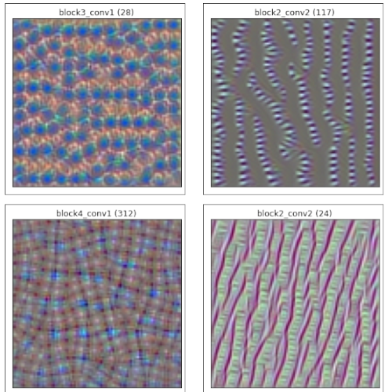

# CNN Filter Visualization Project

This project aims to visualize the filters of a CNN using `TensorFlow`. The visualization technique involves optimizing an input image to maximize the activation of specific filters in the network, thereby generating images that highlight the features detected by those filters.

## Project Overview
The project uses the pre-trained VGG16 model, The model is used to extract and visualize filters from various convolutional layers. The visualizations provide insights into the features that each filter detects at different depths of the network.

## Code Highlights
```
layer_name = 'block2_conv1' # Example layer
visualize_filter(layer_name, iters=1000)

```
## Example Outputs



